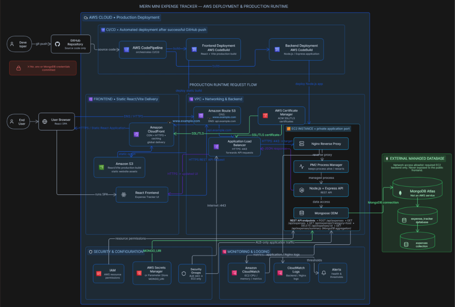

# AWS Deployment Plan

## Architecture



## Deployment Flow

The application follows a MERN-based deployment architecture.

- **GitHub** – Source code and version control
- **AWS CodePipeline + CodeBuild** – CI/CD and automated builds
- **Amazon S3 + CloudFront** – React frontend hosting and delivery
- **Amazon Route 53** – DNS management
- **Application Load Balancer** – Routes API traffic
- **Amazon EC2** – Hosts Node.js/Express backend
- **Nginx + PM2** – Reverse proxy and backend process management
- **MongoDB Atlas** – Production database
- **ACM** – HTTPS/SSL certificates
- **CloudWatch** – Monitoring and logs
- **IAM + Security Groups** – Access and network security

## Request Flow

```text
User
 ↓
CloudFront → S3 (React)
 ↓
HTTPS API Request
 ↓
Route 53 → Load Balancer
 ↓
EC2 → Nginx → PM2 → Node.js/Express
 ↓
Mongoose
 ↓
MongoDB Atlas
 ↓
JSON Response → React UI
```

## CI/CD Flow

```text
Developer
 ↓
GitHub
 ↓
CodePipeline
 ↓
CodeBuild
 ↓
Frontend → S3/CloudFront
Backend → EC2
```
